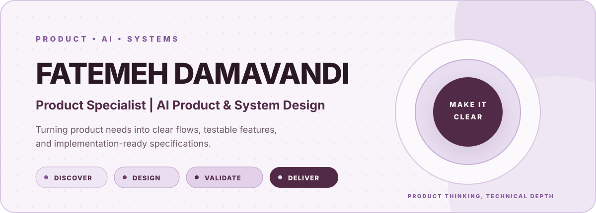

  

  
  
  
  

 

## I turn product needs into systems teams can build.

I'm **Fatemeh Damavandi**, a Product Specialist working across AI product design, system workflows, and technical delivery. My software engineering background helps me move between product decisions and implementation details without losing the intent behind either.

I turn early product needs into clear user flows, scoped features, acceptance criteria, QA plans, and specifications engineers can act on.

<table>
  <tr>
    <td width="33%" valign="top">
      <h3>Find the problem</h3>
      
Use product discovery and analysis to define what needs to change and why.

    </td>
    <td width="33%" valign="top">
      <h3>Make it buildable</h3>
      
Translate decisions into system flows, feature scope, and implementation-ready details.

    </td>
    <td width="33%" valign="top">
      <h3>Test the result</h3>
      
Use product QA and evidence to check the experience, find gaps, and improve the next release.

    </td>
  </tr>
</table>

## Experience

| Company | Role | Period | Focus |
|---|---|---|---|
| **LinkUp** | Product Specialist, AI Product & System Design | Jul 2026 to Present | AI product design, system workflows, technical execution, product QA |
| **Go2Pal** | Product Specialist | May 2025 to Jun 2026 | Product discovery, feature definition, UX flows, delivery alignment |

## Product and technical toolkit

## Ideas in motion

  

## GitHub activity

  
  

---

  <strong>Clear products start with clear decisions.</strong>
    
  

